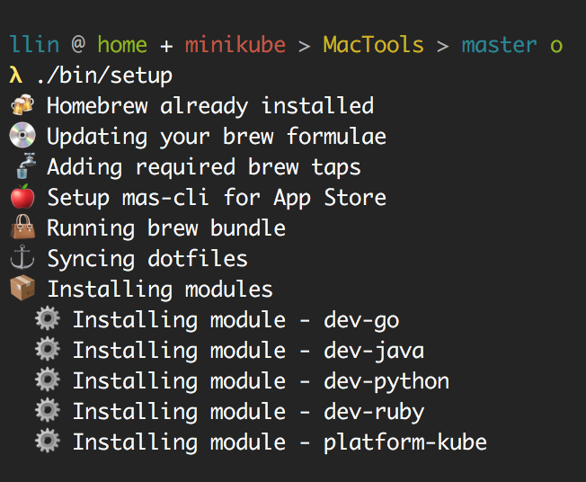

# MacTools

Setup my Mac in one command

## Power it up

A single command to setup every new mac

```bash
$ ./bin/setup
```

## Easy modules

Extensible with easily defined modules

```bash
$ touch ./modules/module-name/setup
$ touch ./modules/module-name/Brewfile
```

## Pretty outputs


